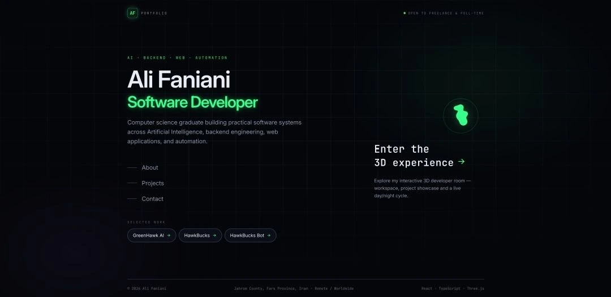

<div align="center">

<a href="https://alifaniani.ir">
  
</a>

# Ali Faniani — Portfolio

### Software Developer · AI · Backend · Web · Automation

A production developer portfolio built with **React, TypeScript, Vite, Three.js, and Cloudflare Pages** — combining a lightweight, SEO-first landing page with a fully interactive 3D developer room at `/room`.

<p>
  <a href="https://alifaniani.ir">Live Website</a>
  &nbsp;•&nbsp;
  <a href="https://github.com/Greenhawk5/AliFaniani-Portfolio">Repository</a>
  &nbsp;•&nbsp;
  <a href="https://alifaniani.ir/room">3D Room</a>
</p>

<p>
  
  
  
  
  
  
  
</p>


</div>

---

## ✦ Overview

This portfolio is intentionally split into two experiences:

- **`/` — Lightweight landing:** a fast, content-first entry point with a semantic H1 in the initial HTML, crawlable navigation, project links, and **no WebGL / Three.js dependency**.
- **`/room` — Interactive 3D experience:** a code-split, fully interactive developer room with optimized GLB assets, dynamic lighting, animated screens, project discovery, camera controls, and a continuous day/night environment.

The architecture keeps these experiences independent: visitors who only want to explore the portfolio do not pay the cost of the 3D scene, while visitors who choose the room can enter it explicitly.

---

## ✦ Highlights

| Area | Implementation |
|---|---|
| Landing | Lightweight SEO-first homepage with semantic HTML and a real initial-HTML H1 |
| 3D | React Three Fiber + Three.js developer room at `/room` |
| Routing | React Router with lazy route modules and route-level code splitting |
| SEO | Route-specific HTML shells, canonical URLs, sitemap generation, JSON-LD, Open Graph |
| Performance | Optimized GLB textures, Meshopt/Draco where applicable, self-hosted fonts, quality tiers |
| Accessibility | Semantic landmarks, focus states, reduced-motion support, no-JS and WebGL fallbacks |
| Security | HSTS, CSP, security headers, Turnstile verification, rate limiting, secret separation |
| Backend | Cloudflare Pages Functions for the contact endpoint |
| Deployment | Cloudflare Pages + Wrangler |

---

## ✦ Selected Projects

<table>
  <tr>
    <td width="33%" align="center">
      <a href="https://alifaniani.ir/projects/greenhawk-ai">
        
      </a>
      <br />
      <b>GreenHawk AI</b>
      <br />
      <sub>AI image colorization platform</sub>
    </td>
    <td width="33%" align="center">
      <a href="https://alifaniani.ir/projects/hawkbucks">
        
      </a>
      <br />
      <b>HawkBucks</b>
      <br />
      <sub>Fortnite V-Bucks mission tracker</sub>
    </td>
    <td width="33%" align="center">
      <a href="https://alifaniani.ir/projects/hawkbucks-bot">
        
      </a>
      <br />
      <b>HawkBucks Bot</b>
      <br />
      <sub>Telegram automation bot</sub>
    </td>
  </tr>
</table>

---

## ✦ Tech Stack

### Frontend

<p>
  
  
  
  
  
</p>

### 3D & Motion

<p>
  
  
  
  
  
</p>

### Platform & State

<p>
  
  
  
</p>

---

## ✦ Architecture

```text
                         ┌───────────────────────┐
                         │      Browser          │
                         └───────────┬───────────┘
                                     │
                                     ▼
                         ┌───────────────────────┐
                         │    Cloudflare Pages   │
                         ├───────────────────────┤
                         │ Route-specific HTML   │
                         │ React application     │
                         │ Static assets         │
                         └───────────┬───────────┘
                                     │
                       ┌─────────────┴─────────────┐
                       ▼                           ▼
              Lightweight `/`                 Lazy `/room`
              SEO-first landing              3D experience
              No WebGL                         Three.js / R3F
                       │                           │
                       └─────────────┬─────────────┘
                                     ▼
                         ┌───────────────────────┐
                         │ Pages Functions       │
                         │ `/api/contact`        │
                         └───────────┬───────────┘
                                     ▼
                              Turnstile + Resend
```

### Core data flow

```text
src/data/projects.ts
        │
        ├── Projects page
        ├── Project detail pages
        ├── 3D showcase board
        ├── Sitemap generation
        └── Route metadata / HTML shells
```

The project is deliberately data-driven: project content lives in `src/data/`, while build-time tooling generates the sitemap and route-specific HTML shells from the same source of truth.

---

## ✦ Interactive 3D Developer Room

The `/room` route is the signature interactive experience of the portfolio.

### Environment

- Continuous day/night interpolation driven by the visitor's real clock.
- Manual time-of-day simulation through the settings panel.
- Custom GLSL sky material and interpolated atmosphere.
- Dynamic sunlight, ambient lighting, stars, city lights, and RGB lighting.

### Interactive elements

- Project showcase board linked to the real portfolio projects.
- Monitor with canvas-rendered animated scenes.
- Wall clock and other focusable room elements.
- Interactive PC/RGB state.
- Cinematic camera presets.
- Free Camera mode with mouse look and WASD/Q/E movement.

### Rendering & effects

- React Three Fiber / Three.js scene graph.
- Bloom, vignette and ACES filmic tone mapping on high-quality settings.
- Canvas textures for dynamic screens.
- Dust particles and ambient effects.
- Quality presets for different hardware levels.

### Delivery

The 3D scene is lazy-loaded and code-split from the landing page. Optimized assets and self-hosted decoders are delivered only when the room is entered.

---

## ✦ SEO

SEO is treated as an architectural concern rather than a collection of meta tags.

- **Route-specific HTML shells** are generated at build time so the initial response for `/`, `/about`, `/projects`, every project detail route, `/contact`, and `/room` contains the correct title, description, canonical and Open Graph data.
- **Canonical URLs** are normalized to HTTPS, the apex domain, lowercase clean paths, and no query strings.
- **Sitemap generation** derives project URLs from `src/data/projects.ts`.
- **Structured data** includes `Person`, `WebSite`, `ProfilePage`, `ItemList`, project `CreativeWork`, and the `/room` `WebPage` schema where appropriate.
- **Social metadata** includes Open Graph and Twitter metadata with static, publicly fetchable imagery.
- **Crawler-friendly HTML** includes a static bootstrap shell with a real homepage H1 and route-specific initial HTML.
- **404 handling** returns real HTTP 404 responses with `X-Robots-Tag: noindex` for unknown routes.
- URL normalization handles trailing slashes, letter case and `.html` variants.

---

## ✦ Performance

The project intentionally separates content performance from 3D richness.

- Landing page ships without Three.js, GLB assets or decoders.
- Route-level code splitting keeps the 3D scene isolated to `/room`.
- GLB assets are optimized with Meshopt/Draco where applicable.
- GLB textures are resized and converted to optimized WebP assets where appropriate.
- Inter and JetBrains Mono are self-hosted.
- Quality tiers adapt DPR, shadows, particles, effects and update rates.
- The room's loading veil is tied to actual asset readiness rather than fake progress.
- Reduced-motion preferences disable unnecessary animation and parallax.

> No formal benchmark suite is included in the repository; performance claims should be evaluated with Lighthouse and browser DevTools against the production build.

---

## ✦ Accessibility

Accessibility is built into the page and room architecture:

- Semantic headings and landmarks.
- A single meaningful H1 per page state.
- Real links/buttons instead of click-only presentation elements.
- `focus-visible` states for interactive controls.
- Accessible labels for navigation and icon controls.
- Reduced-motion support in CSS and the room settings.
- No-JS landing shell.
- WebGL failure fallback with full navigation.
- Descriptive alt text for content images.

The project does not claim formal WCAG certification.

---

## ✦ Security

Implemented security measures include:

- HSTS.
- Content Security Policy.
- `X-Content-Type-Options: nosniff`.
- `X-Frame-Options: DENY`.
- `frame-ancestors 'none'`.
- `Referrer-Policy`.
- restrictive `Permissions-Policy`.
- Cloudflare Turnstile client + server verification.
- Per-IP contact endpoint rate limiting.
- Input validation and HTML escaping before email delivery.
- Clear separation between public `VITE_*` values and server-only secrets.
- Environment secrets stored in Cloudflare Pages rather than source control.

See [`SECURITY.md`](SECURITY.md) for responsible vulnerability reporting.

---

## ✦ Routes

| Route | Purpose |
|---|---|
| `/` | Lightweight landing page |
| `/about` | Profile, skills, education and certificates |
| `/projects` | Project index |
| `/projects/{slug}` | Individual project pages |
| `/contact` | Contact form |
| `/room` | Interactive 3D developer room |
| Unknown routes | Real `404` + `X-Robots-Tag: noindex` |

---

## ✦ Project Structure

```text
AliFaniani-Portfolio/
├── src/
│   ├── app/            # router, providers, site configuration
│   ├── components/
│   │   ├── home/       # landing-page pieces
│   │   ├── layout/     # navbar, footer, settings
│   │   ├── room/       # 3D room overlay / loading UI
│   │   ├── three/      # room scene components
│   │   └── ui/         # reusable UI components
│   ├── data/           # projects, profile, links, route metadata
│   ├── hooks/          # metadata, JSON-LD and utility hooks
│   ├── pages/          # route-level page components
│   ├── services/       # API clients
│   ├── stores/         # Zustand stores
│   ├── styles/         # global styles and font declarations
│   └── three/          # 3D engine, shaders, time/environment logic
├── functions/           # Cloudflare Pages middleware + API
├── public/              # fonts, icons, GLB/decoder assets, OG assets
├── scripts/             # build-time SEO and asset tooling
├── docs/                # profile, project and certificate assets
├── .github/             # repository automation / dependency config
├── LICENSE
├── NOTICE.md
├── SECURITY.md
├── CHANGELOG.md
├── package.json
└── README.md
```

---

## ✦ Getting Started

### Requirements

- Node.js 18+
- npm

### Installation

```bash
git clone https://github.com/Greenhawk5/AliFaniani-Portfolio.git
cd AliFaniani-Portfolio
npm install
```

### Development

```bash
npm run dev
```

### Production build

```bash
npm run build
```

### Production preview

```bash
npm run preview
```

### Cloudflare-compatible local runtime

```bash
npx wrangler pages dev dist
```

This is useful for validating the real middleware, security headers, static route shells and 404 behavior.

---

## ✦ Environment Variables

Create a local `.env` from `.env.example` when needed.

| Variable | Scope | Purpose |
|---|---|---|
| `VITE_SITE_URL` | Client | Canonical production URL |
| `VITE_TURNSTILE_SITE_KEY` | Client | Public Cloudflare Turnstile site key |
| `TURNSTILE_SECRET` | Server secret | Turnstile server verification |
| `RESEND_API_KEY` | Server secret | Contact-form email delivery |
| `EMAIL_FROM` | Server secret | Sender address |
| `EMAIL_TO` | Server secret | Recipient address |

Never place secrets in `VITE_*` variables.

---

## ✦ Development Commands

| Command | Purpose |
|---|---|
| `npm run dev` | Vite development server |
| `npm run build` | Typecheck + Vite build + sitemap + route-shell generation |
| `npm run preview` | Preview the production build |
| `npx wrangler pages dev dist` | Cloudflare-compatible local runtime |
| `npm run lint` | ESLint |
| `npm run format` | Prettier |
| `npm run typecheck` | TypeScript check |
| `npm run check:functions` | Pages Functions TypeScript check |
| `npm run sitemap` | Regenerate sitemap |
| `npm run deploy` | Build and deploy to Cloudflare Pages |

---

## ✦ Validation

The repository currently uses a production-oriented manual validation flow rather than a full automated test suite.

```text
npm run build
      ↓
Cloudflare-compatible local runtime
      ↓
Route / HTTP status checks
      ↓
Initial HTML SEO checks
      ↓
Security header checks
      ↓
Accessibility checks
      ↓
Browser verification
```

Useful verification scripts include:

```bash
node scripts/verify-route-html.mjs
node scripts/verify-headers.mjs
```

No formal automated test framework or Lighthouse benchmark suite is included in the repository.

---

## ✦ Deployment

The site is deployed to **Cloudflare Pages** using Wrangler.

```bash
npm run deploy
```

Production secrets are configured through Cloudflare Pages:

```bash
wrangler pages secret put TURNSTILE_SECRET
wrangler pages secret put RESEND_API_KEY
wrangler pages secret put EMAIL_FROM
wrangler pages secret put EMAIL_TO
```

---

## ✦ Adding a Project

Add a project to:

```text
src/data/projects.ts
```

That data source drives:

- project listings
- detail pages
- the in-room showcase board
- sitemap generation
- route metadata

After adding or removing a project:

```bash
npm run build
```

will regenerate the sitemap and route-specific HTML shells.

One manual synchronization point remains in:

```text
functions/_middleware.js
```

where the valid project slug set is maintained for route validation and 404 handling.

---

## ✦ Repository Documentation

- [`CHANGELOG.md`](CHANGELOG.md) — release history.
- [`LICENSE`](LICENSE) — proprietary license for original project work.
- [`NOTICE.md`](NOTICE.md) — third-party asset attribution and licensing notes.
- [`SECURITY.md`](SECURITY.md) — responsible vulnerability reporting.
- `.github/dependabot.yml` — automated npm dependency update configuration.

Third-party assets are not relicensed by this repository; see `NOTICE.md` for attribution and applicable terms.

---

## ✦ License

The original source code, visual design, and project materials in this repository are **proprietary** — Copyright © 2026 Ali Faniani. All rights reserved.

The repository is publicly viewable for inspection, learning and inspiration. Viewing the code does not grant permission to reproduce, redistribute, republish, modify, sublicense, sell, or create derivative works from the original project without prior written permission.

Third-party assets remain under their respective licenses and terms.

See:

- [`LICENSE`](LICENSE)
- [`NOTICE.md`](NOTICE.md)

---

## ✦ Author

**Ali Faniani** — Software Developer

<p>
  <a href="https://alifaniani.ir">Website</a>
  ·
  <a href="https://github.com/Greenhawk5">GitHub</a>
  ·
  <a href="https://www.linkedin.com/in/ali-faniani">LinkedIn</a>
  ·
  <a href="https://huggingface.co/Greenhawk5">Hugging Face</a>
</p>

---

<div align="center">

<sub>Built with React, TypeScript, Three.js and Cloudflare Pages.</sub>

</div>
