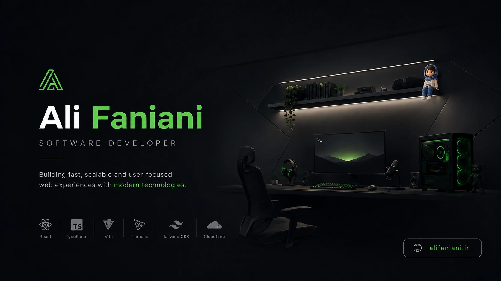
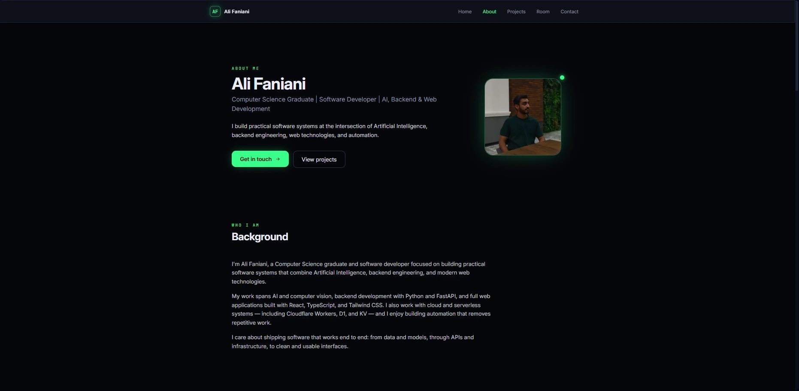
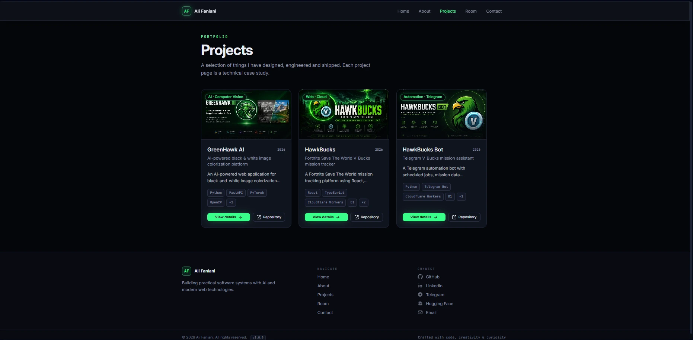
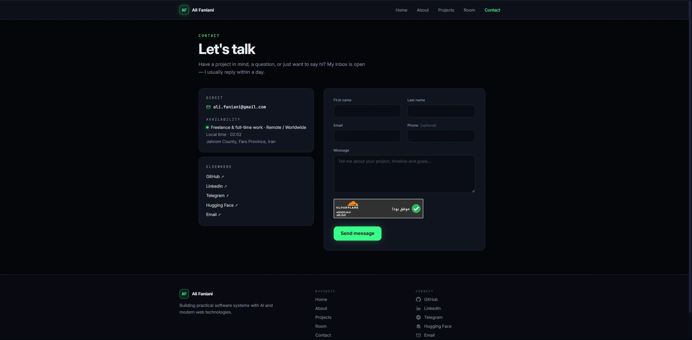

<div align="center">

<a href="https://alifaniani.ir">
  
</a>

# Ali Faniani — Portfolio

### Software Developer · AI · Backend · Web · Automation

<p>
  <a href="https://alifaniani.ir">🌐 Live Website</a>
  &nbsp;·&nbsp;
  <a href="https://alifaniani.ir/room">🧊 3D Developer Room</a>
  &nbsp;·&nbsp;
  <a href="https://github.com/Greenhawk5/AliFaniani-Portfolio">💻 Repository</a>
</p>

<p>
  
  
  
  
  
  
  
</p>


</div>

---

## ✦ About

This repository contains my personal developer portfolio — a production-focused web experience designed to present my work, technical interests, and projects in two complementary ways:

- **A lightweight portfolio:** fast, content-first, SEO-oriented, accessible and intentionally isolated from the 3D engine.
- **An interactive 3D developer room:** a separate `/room` experience where projects and portfolio content can be explored inside a fully rendered environment.

> **Build a portfolio that feels like a real product, not just a collection of pages.**

---

## ✦ Highlights

| | |
|---|---|
| ⚡ **Performance-first** | The landing experience does not load Three.js, WebGL or GLB assets. |
| 🔎 **SEO-first** | Route-specific HTML shells, canonicals, sitemap generation and structured data. |
| 🧊 **Interactive 3D** | A dedicated developer room powered by React Three Fiber and Three.js. |
| 🧩 **Code splitting** | The heavy 3D experience is isolated from the lightweight landing page. |
| 🛡️ **Hardened** | Security headers, CSP, Turnstile verification and contact-endpoint rate limiting. |
| ♿ **Accessible** | Semantic structure, keyboard focus states, reduced motion and graceful fallbacks. |
| ☁️ **Edge deployed** | Cloudflare Pages + Pages Functions + Wrangler. |
| 🎨 **Data-driven** | Projects and route metadata are maintained from shared sources. |

---

## ✦ Tech Stack

### Frontend

<p>
  
  
  
  
  
</p>

### 3D & Motion

<p>
  
  
  
  
  
</p>

### State & Platform

<p>
  
  
  
</p>

---

## ✦ Selected Projects

<table>
<tr>
<td width="33%" align="center">
<a href="https://alifaniani.ir/projects/greenhawk-ai">

</a>
<h3>GreenHawk AI</h3>
<sub>AI image colorization platform</sub>
</td>

<td width="33%" align="center">
<a href="https://alifaniani.ir/projects/hawkbucks">

</a>
<h3>HawkBucks</h3>
<sub>Fortnite V-Bucks mission tracker</sub>
</td>

<td width="33%" align="center">
<a href="https://alifaniani.ir/projects/hawkbucks-bot">

</a>
<h3>HawkBucks Bot</h3>
<sub>Telegram automation bot</sub>
</td>
</tr>
</table>

---

## ✦ Portfolio Gallery

A visual overview of the portfolio interface and its interactive 3D environment.

### General

<table>
<tr>
<td width="50%" align="center">
<a href="docs/profile/home.webp"></a>
<br /><sub><b>Home</b> · Main portfolio landing page</sub>
</td>
<td width="50%" align="center">
<a href="docs/profile/about.webp"></a>
<br /><sub><b>About</b> · Profile, skills and background</sub>
</td>
</tr>
<tr>
<td width="50%" align="center">
<a href="docs/profile/projects.webp"></a>
<br /><sub><b>Projects</b> · Project index and showcase</sub>
</td>
<td width="50%" align="center">
<a href="docs/profile/contact.webp"></a>
<br /><sub><b>Contact</b> · Contact experience</sub>
</td>
</tr>
</table>

### 3D Developer Room

<table>
<tr>
<td width="33%" align="center">
<a href="docs/profile/3D-Room%20(1).webp"></a>
<br /><sub><b>Room I</b></sub>
</td>
<td width="33%" align="center">
<a href="docs/profile/3D-Room%20(2).webp"></a>
<br /><sub><b>Room II</b></sub>
</td>
<td width="33%" align="center">
<a href="docs/profile/3D-Room%20(3).webp"></a>
<br /><sub><b>Room III</b></sub>
</td>
</tr>
</table>

> 🧊 **Explore the room live:** [`alifaniani.ir/room`](https://alifaniani.ir/room)

---

## ✦ Architecture

```text
                              ┌─────────────────────┐
                              │       Browser       │
                              └──────────┬──────────┘
                                         │
                                         ▼
                              ┌─────────────────────┐
                              │   Cloudflare Pages  │
                              ├─────────────────────┤
                              │ Route HTML shells   │
                              │ React application   │
                              │ Static assets       │
                              └──────────┬──────────┘
                                         │
                       ┌─────────────────┴─────────────────┐
                       ▼                                   ▼
              ┌──────────────────┐                ┌──────────────────┐
              │  Lightweight `/` │                │   Lazy `/room`   │
              │ SEO-first        │                │ Three.js / R3F   │
              │ No WebGL         │                │ GLB assets        │
              │ Fast entry       │                │ Interactive scene │
              └────────┬─────────┘                └────────┬─────────┘
                       │                                   │
                       └─────────────────┬─────────────────┘
                                         ▼
                              ┌─────────────────────┐
                              │  Pages Functions    │
                              │    /api/contact     │
                              └──────────┬──────────┘
                                         ▼
                                  Turnstile + Resend
```

### Shared data flow

```text
src/data/projects.ts
        │
        ├── Projects index
        ├── Project detail pages
        ├── 3D showcase board
        ├── Sitemap generation
        └── Route metadata / HTML shells
```

---

## ✦ Interactive 3D Room

The `/room` route is the signature experience of the portfolio.

### Environment

- Continuous day/night interpolation driven by the visitor's real clock.
- Manual time-of-day simulation through the settings panel.
- Custom GLSL sky material and interpolated atmosphere.
- Dynamic sunlight, ambient lighting, stars, city lights and RGB lighting.

### Interactive elements

- Project showcase board linked to portfolio projects.
- Monitor with canvas-rendered animated scenes.
- Wall clock and other focusable room elements.
- Interactive PC/RGB state.
- Cinematic camera presets.
- Free Camera mode with mouse look and WASD/Q/E movement.

### Rendering

- React Three Fiber + Three.js scene graph.
- Bloom, vignette and ACES filmic tone mapping on high-quality settings.
- Canvas textures for dynamic screens.
- Dust particles and ambient effects.
- Quality presets for different hardware levels.

### Delivery

The 3D scene is lazy-loaded and code-split from the landing page. Optimized assets and self-hosted decoders are delivered only when the room is entered.

---

## ✦ SEO

SEO is treated as part of the application architecture.

- **Route-specific HTML shells** provide correct initial metadata for every public route.
- **Canonical URLs** are normalized to HTTPS, the apex domain, clean paths and no query strings.
- **Sitemap generation** derives project URLs from `src/data/projects.ts`.
- **Structured data** includes `Person`, `WebSite`, `ProfilePage`, `ItemList`, project `CreativeWork` and the `/room` `WebPage` schema where appropriate.
- **Open Graph + Twitter metadata** are included for share previews.
- **Crawler-friendly HTML** includes a static bootstrap shell with a real H1 and crawlable navigation.
- **404 handling** returns real HTTP 404 responses with `X-Robots-Tag: noindex`.
- URL normalization handles trailing slashes, letter case and `.html` variants.

---

## ✦ Performance

The portfolio intentionally separates content performance from 3D richness.

- Landing page ships without Three.js, GLB assets or decoders.
- Route-level code splitting isolates the 3D scene to `/room`.
- GLB assets are optimized with Meshopt/Draco where applicable.
- Textures are resized and converted to optimized WebP assets where appropriate.
- Inter and JetBrains Mono are self-hosted.
- Quality tiers adapt DPR, shadows, particles, effects and update rates.
- The room loading veil is tied to actual asset readiness rather than fake progress.
- Reduced-motion preferences disable unnecessary animation and parallax.

> No formal benchmark suite is included. Performance should be evaluated against the production build with Lighthouse and browser DevTools.

---

## ✦ Accessibility

Accessibility is built into both the document structure and the interactive experience:

- Semantic headings and landmarks.
- A single meaningful H1 per page state.
- Real links and buttons for interactive controls.
- `focus-visible` states.
- Accessible labels for navigation and icon controls.
- Reduced-motion support.
- No-JS landing shell.
- WebGL failure fallback with full navigation.
- Descriptive alt text for content images.

The project does not claim formal WCAG certification.

---

## ✦ Security

Implemented security measures include:

- HSTS.
- Content Security Policy.
- `X-Content-Type-Options: nosniff`.
- `X-Frame-Options: DENY`.
- `frame-ancestors 'none'`.
- `Referrer-Policy`.
- Restrictive `Permissions-Policy`.
- Cloudflare Turnstile client + server verification.
- Per-IP contact endpoint rate limiting.
- Input validation and HTML escaping before email delivery.
- Separation between public `VITE_*` values and server-only secrets.
- Production secrets stored through Cloudflare Pages rather than source control.

See [`SECURITY.md`](SECURITY.md) for responsible vulnerability reporting.

---

## ✦ Routes

| Route | Purpose |
|---|---|
| `/` | Lightweight landing page |
| `/about` | Profile, skills, education and certificates |
| `/projects` | Project index |
| `/projects/{slug}` | Individual project pages |
| `/contact` | Contact form |
| `/room` | Interactive 3D developer room |
| Unknown routes | Real `404` + `X-Robots-Tag: noindex` |

---

## ✦ Project Structure

```text
AliFaniani-Portfolio/
├── src/
│   ├── app/             # Router, providers and site configuration
│   ├── components/
│   │   ├── home/        # Landing-page components
│   │   ├── layout/      # Navigation, footer and settings
│   │   ├── room/        # 3D room overlay / loading UI
│   │   ├── three/       # Room scene components
│   │   └── ui/          # Reusable UI components
│   ├── data/            # Projects, profile, links and route metadata
│   ├── hooks/           # Metadata, JSON-LD and utility hooks
│   ├── pages/           # Route-level pages
│   ├── services/        # API clients
│   ├── stores/          # Zustand stores
│   ├── styles/          # Global styles and fonts
│   └── three/           # 3D engine, shaders and environment logic
├── functions/            # Cloudflare Pages middleware + API
├── public/               # Fonts, icons, GLB/decoder and OG assets
├── docs/                 # Portfolio, project and certificate assets
├── scripts/              # SEO and asset build tooling
├── .github/              # Repository automation
├── LICENSE
├── NOTICE.md
├── SECURITY.md
├── CHANGELOG.md
├── package.json
└── README.md
```

---

## ✦ Getting Started

### Requirements

- Node.js 18+
- npm

### Installation

```bash
git clone https://github.com/Greenhawk5/AliFaniani-Portfolio.git
cd AliFaniani-Portfolio
npm install
```

### Development

```bash
npm run dev
```

### Production build

```bash
npm run build
```

### Production preview

```bash
npm run preview
```

### Cloudflare-compatible local runtime

```bash
npx wrangler pages dev dist
```

---

## ✦ Environment Variables

Create a local `.env` from `.env.example` when needed.

| Variable | Scope | Purpose |
|---|---|---|
| `VITE_SITE_URL` | Client | Canonical production URL |
| `VITE_TURNSTILE_SITE_KEY` | Client | Public Cloudflare Turnstile site key |
| `TURNSTILE_SECRET` | Server secret | Turnstile server verification |
| `RESEND_API_KEY` | Server secret | Contact-form email delivery |
| `EMAIL_FROM` | Server secret | Sender address |
| `EMAIL_TO` | Server secret | Recipient address |

> Never place secrets in `VITE_*` variables.

---

## ✦ Development Commands

| Command | Purpose |
|---|---|
| `npm run dev` | Start the Vite development server |
| `npm run build` | Typecheck + build + sitemap + route-shell generation |
| `npm run preview` | Preview the production build |
| `npx wrangler pages dev dist` | Run the Cloudflare-compatible local runtime |
| `npm run lint` | Run ESLint |
| `npm run format` | Run Prettier |
| `npm run typecheck` | Run TypeScript checks |
| `npm run check:functions` | Check Pages Functions TypeScript |
| `npm run sitemap` | Regenerate the sitemap |
| `npm run deploy` | Build and deploy to Cloudflare Pages |

---

## ✦ Validation

The repository uses a production-oriented validation flow.

```text
                 npm run build
                      │
                      ▼
          Cloudflare-compatible runtime
                      │
          ┌───────────┼───────────┐
          ▼           ▼           ▼
       Routes       SEO       Security
       / HTTP      HTML       headers
       status      checks      checks
          │           │           │
          └───────────┼───────────┘
                      ▼
               Browser testing
```

Useful verification scripts:

```bash
node scripts/verify-route-html.mjs
node scripts/verify-headers.mjs
```

No formal automated test framework or Lighthouse benchmark suite is included in the repository.

---

## ✦ Deployment

The production site is deployed to **Cloudflare Pages** using Wrangler.

```bash
npm run deploy
```

Production secrets are configured through Cloudflare Pages:

```bash
wrangler pages secret put TURNSTILE_SECRET
wrangler pages secret put RESEND_API_KEY
wrangler pages secret put EMAIL_FROM
wrangler pages secret put EMAIL_TO
```

---

## ✦ Adding a Project

Add a project to:

```text
src/data/projects.ts
```

That shared source drives:

- Project listings.
- Project detail pages.
- The in-room showcase board.
- Sitemap generation.
- Route metadata.

Then run:

```bash
npm run build
```

The build regenerates the sitemap and route-specific HTML shells.

One manual synchronization point remains in:

```text
functions/_middleware.js
```

where the valid project slug set is maintained for route validation and 404 handling.

---

## ✦ Repository Documentation

| File | Purpose |
|---|---|
| [`CHANGELOG.md`](CHANGELOG.md) | Version history and release notes |
| [`LICENSE`](LICENSE) | Proprietary license for original project work |
| [`NOTICE.md`](NOTICE.md) | Third-party asset attribution and licensing notes |
| [`SECURITY.md`](SECURITY.md) | Responsible vulnerability reporting |
| [`.github/dependabot.yml`](.github/dependabot.yml) | Automated npm dependency update configuration |

Third-party assets are not relicensed by this repository. See [`NOTICE.md`](NOTICE.md) for attribution and applicable terms.

---

## ✦ License

The original source code, visual design and project materials in this repository are **proprietary** — Copyright © 2026 Ali Faniani. All rights reserved.

The repository is publicly viewable for inspection, learning and inspiration. Viewing the code does **not** grant permission to reproduce, redistribute, republish, modify, sublicense, sell or create derivative works from the original project without prior written permission.

Third-party assets remain under their respective licenses and terms.

See [`LICENSE`](LICENSE) and [`NOTICE.md`](NOTICE.md).

---

## ✦ Author

**Ali Faniani** — Software Developer

<p>
  <a href="https://alifaniani.ir">Website</a>
  &nbsp;·&nbsp;
  <a href="https://github.com/Greenhawk5">GitHub</a>
  &nbsp;·&nbsp;
  <a href="https://www.linkedin.com/in/ali-faniani">LinkedIn</a>
  &nbsp;·&nbsp;
  <a href="https://huggingface.co/Greenhawk5">Hugging Face</a>
</p>

---

<div align="center">

<sub>Built with React, TypeScript, Three.js and Cloudflare Pages.</sub>

</div>
