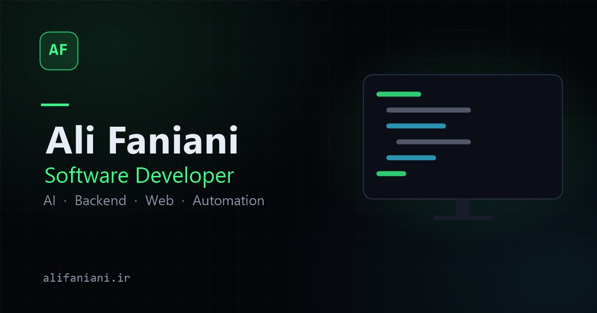

# Ali Faniani — Portfolio

[](https://alifaniani.ir)
[](CHANGELOG.md)
[](LICENSE)
[](https://react.dev)
[](https://www.typescriptlang.org)
[](https://vite.dev)
[](https://threejs.org)
[](https://pages.cloudflare.com)

A production developer portfolio built as a **Vite + React + TypeScript SPA**,
deployed on **Cloudflare Pages**. The root route (`/`) is a deliberately
lightweight, SEO-first landing page; the signature experience — a fully
procedural, interactive **3D developer room** rendered with React Three
Fiber — lives at `/room` and is strictly code-split so the two never load
each other.

**Live:** [alifaniani.ir](https://alifaniani.ir) · **Repository:**
[Greenhawk5/AliFaniani-Portfolio](https://github.com/Greenhawk5/AliFaniani-Portfolio)



## Overview

Most portfolios choose between fast content pages and impressive interactive
experiences. This repository implements both, as separate routes with a hard
boundary between them:

- **`/`** — a landing page that ships a few kilobytes of application
  JavaScript, a real semantic `<h1>` in the initial HTML, and zero WebGL.
- **`/room`** — a fully procedural 3D developer room (models, lighting,
  post-processing, interactive objects) that is lazy-loaded only when
  requested.

Everything content-related is **data-driven**: projects, profile identity,
social links, sitemap entries, route metadata and static route shells all
derive from `src/data/` at build time.

## Highlights

- **Landing/room separation** — the 3D experience is an isolated, lazy-loaded
  route; the landing page never downloads Three.js, GLB assets or decoders.
- **Crawler-first SPA** — build-time route-specific HTML shells give every
  route a correct `<title>`, canonical, description and Open Graph metadata
  in the *initial* response, plus a static bootstrap `<h1>` on the homepage.
- **Data-driven architecture** — `projects.ts` drives the project index,
  detail pages, the in-room showcase board, sitemap and route metadata.
- **Real 404 semantics** — a Cloudflare Pages middleware returns actual
  `HTTP 404` (+ `X-Robots-Tag: noindex`) for unknown routes instead of an
  SPA soft-404, with URL normalization (trailing slash, letter case,
  `.html`).
- **Hardened** — enforced Content-Security-Policy, HSTS, hardened contact
  endpoint (Turnstile verification, per-IP rate limiting, input escaping),
  self-hosted fonts, strict environment-variable separation.
- **Continuous day/night 3D environment** — a keyframed atmosphere model
  sampled in real time from the visitor's clock, with a manual time-of-day
  simulator.

## Projects

| Project | Screenshot | Description |
|---|---|---|
| **GreenHawk AI** |  | AI-powered black & white image colorization platform (CNN, GAN and diffusion models behind a FastAPI backend) |
| **HawkBucks** |  | Fortnite Save The World V-Bucks mission tracker with a React/TypeScript frontend on a Cloudflare serverless backend |
| **HawkBucks Bot** |  | Telegram automation bot with scheduled jobs, mission processing, reminders and image generation |

## Tech Stack

| Layer | Technology | Why |
|---|---|---|
| UI | [React 19](https://react.dev) | Component model, suspense-based lazy routes |
| Language | [TypeScript](https://www.typescriptlang.org) (strict) | Type safety across pages, data models and the 3D layer |
| Build | [Vite 8](https://vite.dev) | Fast dev server, ESM output, route-level code splitting |
| Routing | [React Router 7](https://reactrouter.com) | Data router with lazy route modules |
| Styling | [Tailwind CSS 4](https://tailwindcss.com) | Utility-first system driven by CSS custom-property tokens |
| 3D | [Three.js r185](https://threejs.org), [React Three Fiber](https://docs.pmnd.rs/react-three-fiber), [Drei](https://github.com/pmndrs/drei) | Declarative WebGL scene graph, loaders and helpers |
| Animation | [GSAP](https://gsap.com), [Framer Motion](https://motion.dev) | Cinematic camera transitions; UI overlay motion |
| State | [Zustand 5](https://zustand.docs.pmnd.rs) | Small stores (settings/time/UI/projects) with `localStorage` persistence |
| Backend | [Cloudflare Pages Functions](https://developers.cloudflare.com/pages/functions/) | Contact endpoint: Turnstile verification, rate limiting, email delivery |
| Hosting | [Cloudflare Pages](https://pages.cloudflare.com) | Global static delivery + Functions runtime + custom `_headers` |

## Architecture

```
Browser
  ↓
Cloudflare Pages
  ├── public/_headers          HSTS · CSP · security & cache headers
  ├── Static route shells      /about.html, /room.html, … (build-time
  │                            generated; route-correct title/canonical/OG)
  ├── React application        SPA: landing, content pages, 3D room (code-split)
  └── Pages Functions
        └── /api/contact       Turnstile verification → rate limit → email
```

`functions/_middleware.js` runs before every request: it redirects the
`pages.dev` subdomain, normalizes URLs (trailing slash, letter case,
`.html`), serves the matching route shell for valid routes, passes static
assets and API routes through, and returns real `HTTP 404` responses
(+ `X-Robots-Tag: noindex`) for anything else.

```
src/
├── app/            router, providers, error boundary, site config
├── components/
│   ├── home/       landing-page CTA pieces
│   ├── layout/     navbar, footer, settings panel, back-to-top
│   ├── room/       room overlay UI (hints, time chip, slider), loading veil
│   ├── three/      3D scene components (room, desk, PC, boards, clocks)
│   └── ui/         design-system components (buttons, cards, gallery, …)
├── data/           single source of truth: projects, profile, links, route metadata
├── hooks/          useDocumentMeta, useJsonLd, media/clock helpers
├── pages/          Home (landing) · Room (3D) · About · Projects · ProjectDetail · Contact · NotFound
├── services/       contact API client
├── stores/         Zustand stores (settings, time, UI, projects)
├── styles/         design tokens, font-faces, landing/boot styles
└── three/          engine code: time engine, environment model, sky shader, canvas screens
functions/          Cloudflare Pages middleware + contact API function
public/             fonts, icons, GLB models, Draco decoders, OG image, manifest
scripts/            build-time generation + asset optimization tooling
docs/               project images and assets used across the site
```

## Interactive 3D Developer Room

`/room` is a fully procedural 3D developer workspace — every surface, screen
and light is generated in code or loaded as optimized GLB assets.

- **Live day/night cycle** — a keyframed atmosphere model (`three/timeEngine`)
  is sampled per frame from the visitor's real clock (local or UTC): sun/moon
  position and color, a custom GLSL sky-gradient shader (`three/skyMaterial`),
  light intensities, RGB strip strength, stars and city lights all interpolate
  continuously — there are no discrete day/night states. A simulation mode
  with a time-of-day slider is available from the settings panel.
- **Canvas-textured screens** — the monitor (animated code/terminal scenes),
  the project showcase board (a slideshow fed by real project data), the
  social board and the digital wall clock are drawn to `<canvas>` textures in
  real time and mapped onto 3D surfaces.
- **Interactive objects** — click-to-focus the project board, monitor, wall
  clock and PC (RGB toggle); objects highlight on hover and drive app
  navigation (the board opens the matching project page).
- **Two camera systems** — a GSAP-driven cinematic rig with focus presets, and
  a Free Cam mode (drag to look, WASD movement, Q/E vertical, Shift sprint).
- **Atmosphere** — dust particles, neon signage, custom GLSL sky shader, and
  bloom + vignette + ACES filmic tone-mapping post-processing on the high
  quality tier.
- **Optimized assets** — GLB models compressed with Meshopt/Draco and WebP
  textures, decoded at runtime via self-hosted decoders (see
  [Performance](#performance)).
- **Robust delivery** — a loading veil gated on *real* asset readiness (no
  fake progress), a settings panel for quality/motion/timezone/camera, and a
  static fallback with full navigation if WebGL is unavailable.

## SEO

The site is a static SPA, so crawler-visible HTML is generated deliberately:

- **Build-time route shells** — after `vite build`,
  `scripts/generate-route-html.mjs` derives per-route metadata from
  `src/data/route-meta.ts` (which reads `projects.ts` and the site config)
  and emits a static HTML file per route with the correct `<title>`,
  canonical URL, meta description, `og:url`, `og:title`, `og:description`
  and Twitter tags. The middleware serves these shells to every visitor.
- **Canonical URLs** — one canonical per route, normalized (HTTPS, apex
  domain, lowercase, no trailing slash, no query strings), emitted in the
  initial HTML and kept in sync during SPA navigation by
  `useDocumentMeta`.
- **Sitemap** — `public/sitemap.xml` is regenerated on every build from
  `src/data/projects.ts`, so it can never drift from the real routes.
- **Structured data (JSON-LD)** — a `Person` + `WebSite` graph ships in the
  initial HTML; `ProfilePage` (/about), `ItemList` (/projects),
  `CreativeWork` (project pages) and `WebPage` (/room) are injected per
  route via a self-cleaning hook (`useJsonLd`) that removes stale schemas
  during SPA navigation.
- **Open Graph / Twitter** — an identity-first global card plus
  route-correct titles, descriptions, URLs and image metadata per route.
- **Crawlable initial HTML** — the homepage ships a static bootstrap shell
  with a real `<h1>`, introduction and navigation, visible before React
  mounts and to no-JS visitors.
- **Clean failure** — unknown routes return real `404` responses with
  `X-Robots-Tag: noindex`; `robots.txt` and the sitemap are served
  statically.

## Performance

Performance work concentrates on keeping the landing page tiny while making
the 3D room load as efficiently as possible:

- **Route-level code splitting** — every page (and the entire 3D scene) is a
  separate lazy-loaded chunk; the landing page ships only a few kilobytes of
  application JavaScript and never downloads Three.js, GLB assets or
  decoders.
- **3D asset pipeline** — GLB models are compressed with Meshopt (geometry)
  and Draco (where beneficial), with WebP textures capped at sane dimensions;
  embedded textures are decoded at runtime by self-hosted Draco/Meshopt
  decoders. Tooling in `scripts/` audits and regenerates these assets.
- **Self-hosted fonts** — Inter (latin variable) and JetBrains Mono
  (400/600) are served from `public/fonts/` with `font-display: swap` and
  preloaded; no external font requests.
- **Optimized images** — project artwork is WebP, width-capped to display
  sizes, with explicit dimensions and lazy loading below the fold.
- **Quality tiers** — High / Medium / Performance presets (auto-detected from
  pointer type, device memory and CPU cores, manually overridable) control
  device pixel ratio, shadows, anti-aliasing, particles, bloom and
  screen-update rates.
- **Honest loading veil** — the room's loading state is driven by real asset
  readiness via drei's `useProgress`; there is no fake progress, and loader
  errors release the veil instead of trapping users.
- **Reduced motion** — `prefers-reduced-motion` disables CSS animation and
  the app-level camera parallax/ambient motion, with a manual override.
- **First-paint shell** — the homepage renders a static, styled bootstrap
  layout before any JavaScript executes.

No formal performance benchmark suite exists in the repository; measure with
Lighthouse/DevTools against the production build.

## Accessibility

Accessibility considerations include:

- A single, visible, semantic `<h1>` per route (including in the initial
  HTML), with a logical heading hierarchy on content pages.
- Semantic landmarks (`header`, `nav`, `main`, `section`, `footer`), labeled
  navigation regions and real anchor/button elements throughout.
- Visible `focus-visible` indicators and enlarged hit areas on compact icon
  controls (room overlay, settings, gallery dots/arrows).
- A contact form with labeled fields, `aria-invalid` error states, a
  correctly hidden honeypot field and Turnstile verification.
- `prefers-reduced-motion` support in CSS and as an in-app motion setting
  that disables camera parallax and ambient animation.
- A static no-JS bootstrap shell, and a WebGL failure fallback with full
  navigation if the 3D room cannot start.
- Alt text on content images and `aria-label`s on icon-only controls.

No formal WCAG audit has been performed; the implementation reflects
deliberate accessibility engineering rather than certification.

## Security

Security posture (implemented in `public/_headers` and the Pages Functions):

- **Strict-Transport-Security** — `max-age=31536000` (deliberately without
  `includeSubDomains`/`preload`).
- **Content-Security-Policy** — enforced, `default-src 'self'`. The only
  non-self sources are Cloudflare Turnstile
  (`challenges.cloudflare.com` for script/frame/connect) and
  `'wasm-unsafe-eval'` for the Draco/Meshopt WASM decoders;
  `style-src 'unsafe-inline'` is required by React inline style attributes,
  and `img-src`/`connect-src` `blob:` by three.js GLB texture handling.
- **Clickjacking / sniffing** — `X-Frame-Options: DENY`,
  `frame-ancestors 'none'`, `X-Content-Type-Options: nosniff`.
- **Referrer-Policy** `strict-origin-when-cross-origin`; **Permissions-Policy**
  disables camera, microphone, geolocation and interest-cohort.
- **Contact endpoint** — Cloudflare Turnstile (client widget + server-side
  `siteverify`), per-IP rate limiting (5 requests / 10 minutes), strict input
  validation and HTML escaping before email delivery via Resend.
- **Environment separation** — `VITE_*` values are public client
  configuration; all credentials (`TURNSTILE_SECRET`, `RESEND_API_KEY`,
  `EMAIL_FROM`, `EMAIL_TO`) live only as Cloudflare Pages secrets read from
  the Functions `env` binding. `.env*` files are git-ignored.

No security claims beyond what is implemented here are made; report issues
responsibly (see `SECURITY.md`).

## Routes

| Route | Purpose |
|---|---|
| `/` | Lightweight SEO landing page |
| `/about` | About — profile, skills, education, certificates |
| `/projects` | Project index |
| `/projects/{slug}` | Project case study (`greenhawk-ai`, `hawkbucks`, `hawkbucks-bot`) |
| `/contact` | Contact form (Turnstile-protected) with local time and availability |
| `/room` | Interactive 3D developer room |
| anything else | Real `404` + `X-Robots-Tag: noindex` |

URL normalization is enforced by the middleware: trailing slashes and letter
case redirect (`308`) to the canonical path, `.html` variants redirect to
clean paths, and `alifaniani.pages.dev` redirects to the apex domain.

## Getting Started

```bash
git clone https://github.com/Greenhawk5/AliFaniani-Portfolio.git
cd AliFaniani-Portfolio
npm install
npm run dev
```

The site runs at the Vite dev server URL. Node.js 18+ is recommended
(developed on Node 22).

### Environment Variables

Copy `.env.example` to `.env` for local overrides — real `.env*` files are
git-ignored and never committed.

| Variable | Scope | Purpose |
|---|---|---|
| `VITE_SITE_URL` | client (public) | Canonical production URL; defaults to `https://alifaniani.ir` |
| `VITE_TURNSTILE_SITE_KEY` | client (public) | Cloudflare Turnstile site key — public by design |
| `TURNSTILE_SECRET` | server (Cloudflare secret) | Turnstile server-side verification |
| `RESEND_API_KEY` | server (Cloudflare secret) | Contact-form email delivery |
| `EMAIL_FROM` / `EMAIL_TO` | server (Cloudflare secret) | Contact-form addresses |

`VITE_*` values are embedded in client JavaScript — never put secrets there.
Server-only values are set with `wrangler pages secret put …` and read from
the Functions `env` binding in `functions/api/contact.ts`.

## Development Commands

| Command | Purpose |
|---|---|
| `npm run dev` | Vite dev server |
| `npm run build` | Typecheck + production build + sitemap & route-shell generation |
| `npm run preview` | Serve the production build locally |
| `npx wrangler pages dev dist` | Cloudflare-compatible runtime (real middleware, `_headers`, 404 behavior) |
| `npm run lint` | ESLint |
| `npm run format` | Prettier |
| `npm run typecheck` | TypeScript project check |
| `npm run check:functions` | TypeScript check for Pages Functions |
| `npm run sitemap` | Regenerate `public/sitemap.xml` only |
| `npm run deploy` | Production build + `wrangler pages deploy dist` |

## Validation

There is no automated test framework in this repository. Validation is a
manual production-checklist flow:

```text
npm run build
  ↓  typecheck + bundle + sitemap/route-shell generation
npm run preview            (or npx wrangler pages dev dist)
  ↓  Cloudflare-compatible runtime: middleware, headers, real 404s
Route checks               all valid routes 200 · unknown routes 404 + noindex
SEO checks                 per-route title/canonical/OG in the initial HTML
Security headers           HSTS/CSP/nosniff/X-Frame/Referrer/Permissions
Accessibility               headings, keyboard navigation, no-JS shell, room fallback
scripts/verify-route-html.mjs · scripts/verify-headers.mjs
                           scripted per-route metadata + header assertions
                           against the local runtime
```

Both verify scripts accept the runtime base URL constant at the top of the
file and are the fastest way to re-check the initial-HTML metadata matrix
after content changes.

## Deployment

The site deploys to **Cloudflare Pages** with
`wrangler.toml` (`pages_build_output_dir = "dist"`):

```bash
npm run deploy     # npm run build + wrangler pages deploy dist
```

Server-only secrets are configured once per project:

```bash
wrangler pages secret put TURNSTILE_SECRET
wrangler pages secret put RESEND_API_KEY
wrangler pages secret put EMAIL_FROM
wrangler pages secret put EMAIL_TO
```

Production headers (HSTS, CSP, caching) come from `public/_headers`, which
Cloudflare Pages applies at the edge.

## Adding a Project

Add an entry to **`src/data/projects.ts`** — it is the single source of truth
for the Projects page, the detail pages, the 3D showcase board, route
metadata and the generated shells.

`npm run build` then automatically:

1. Regenerates `public/sitemap.xml` from the project slugs
   (`scripts/generate-sitemap.mjs`).
2. Regenerates the static route shell for the new detail page
   (`scripts/generate-route-html.mjs`, driven by `src/data/route-meta.ts`).

**One manual step remains:** update the `PROJECT_SLUGS` set in
`functions/_middleware.js` — it powers real 404 responses and URL
normalization for project routes.

## Documentation

- `docs/` — project artwork, profile images and certificates used by the site.
- `scripts/` — build-time generators and asset optimization tooling (each
  script documents its own usage).
- `public/_headers` — deployed security/caching header definitions.
- [NOTICE.md](NOTICE.md) — third-party asset attribution and licensing notes.
- [CHANGELOG.md](CHANGELOG.md) — release history.
- `Project Details/` — local design notes, git-ignored, not part of the
  deployed repository.

## Contributing

This is a personal portfolio, developed and maintained independently.
Genuine bug reports are welcome via
[GitHub issues](https://github.com/Greenhawk5/AliFaniani-Portfolio/issues).

## License

The original source code, visual design, and project materials in this
repository are **proprietary** — Copyright © 2026 Ali Faniani. All rights
reserved.

The repository is publicly viewable: inspecting the implementation and using
it for learning or inspiration is welcome. However, reproduction,
redistribution, republication, modification, sublicensing, or creation of
derivative works from the original project — including presenting it as
another person's portfolio — is not permitted without prior written
permission.

Third-party assets (3D models, loading animations) are **not** covered by
this license and remain governed by their own terms — see
[NOTICE.md](NOTICE.md) for full attribution and conditions.

- Full terms: [LICENSE](LICENSE)
- Third-party attribution: [NOTICE.md](NOTICE.md)
- Release history: [CHANGELOG.md](CHANGELOG.md)

## Author

**Ali Faniani** — Software Developer

- Website: [alifaniani.ir](https://alifaniani.ir)
- GitHub: [@Greenhawk5](https://github.com/Greenhawk5)
- LinkedIn: [ali-faniani](https://www.linkedin.com/in/ali-faniani)
- Hugging Face: [Greenhawk5](https://huggingface.co/Greenhawk5)